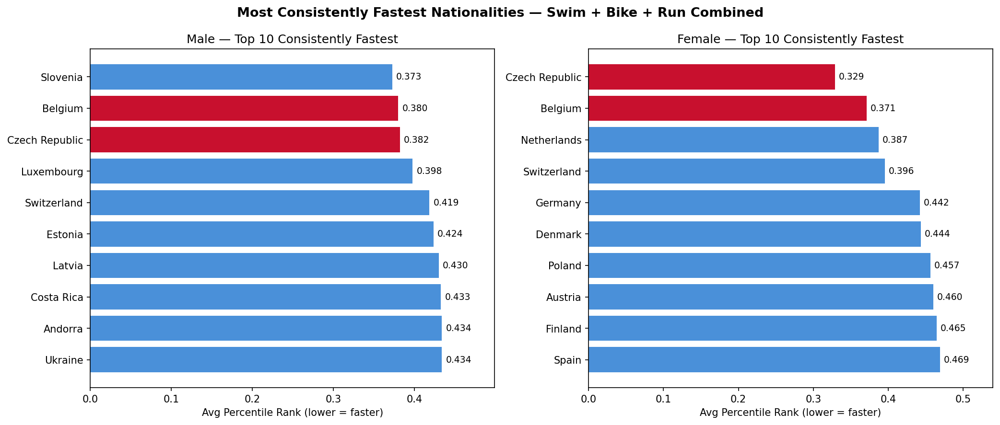
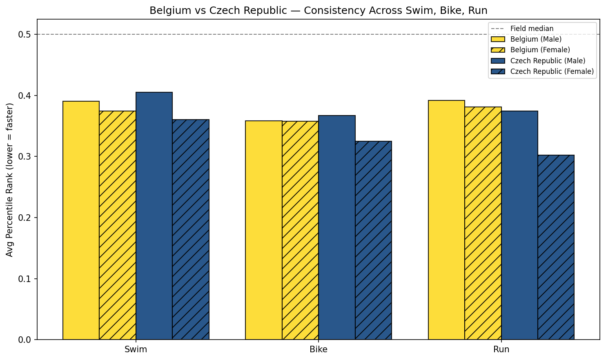
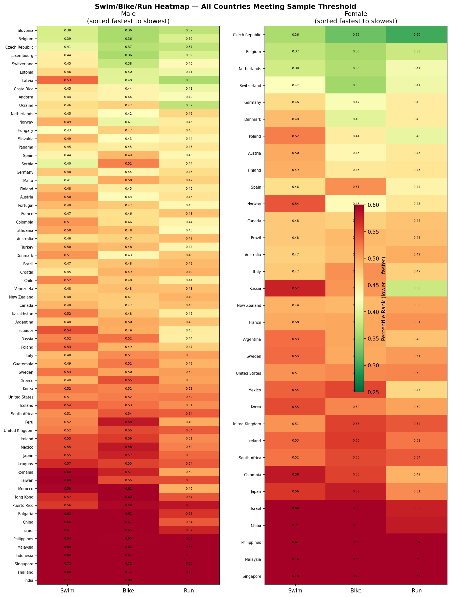

# Which Nationalities Are the Fastest Across Swim, Bike, and Run? An Ironman Triathlon Analysis (2002-2024)

A look at over 800,000 Ironman 140.6 finisher records to find which nationalities consistently rank fastest in the swim, bike, and run legs, for both men and women, after controlling for the fact that no two Ironman races have the same course or conditions.

## Why I built this

Most of my other projects use New Zealand government data, usually framed through a Philippine policy lens. This one is different. I wanted a dataset messy enough to actually test my data cleaning instincts, and large enough that any pattern I found would hold up statistically instead of being noise from a small sample. Ironman's results data, scraped from race timing systems across dozens of countries over 22 years, turned out to be exactly that kind of mess, and exactly that large.

## Data source

Ironman 140.6 Results Dataset (2002-2024), Kaggle, uploaded by miguswong.
https://www.kaggle.com/datasets/miguswong/ironman-140-6-results-dataset-2002-2024

The dataset has six files. I used `results.csv` (1,096,719 rows) joined to `races.csv` for the year field. The other files, two single-year World Championship exports and a historical Kona winners list, either duplicated what was already in `results.csv` or didn't include split times, so they didn't make it into the final analysis.

## The problem with comparing raw times

Bike courses are flat in some races and brutal in others. Swims are wetsuit-legal in cold water and not in warm water. Run courses range from flat out-and-backs to hilly trails in 35 degree heat. Averaging a country's raw swim time across every race its athletes have entered mostly tells you which countries happened to race more often on easy courses.

To get around this, I ranked every finisher's swim, bike, and run time as a percentile within their own race and gender field, then averaged that percentile by nationality. A score of 0.30 means a country's athletes typically finish that leg in the top 30 percent of their field, whether the course was Kona or a flat race in the Netherlands.

I also set a minimum of 200 finishers per country per gender before including a country in the rankings. Below that, one or two unusually fast or slow athletes can swing the average enough to make it meaningless.

## Cleaning the country field

This dataset's nationality field was scraped from race organizer systems in different countries, and it shows. I found the same country listed under its English name, its native-language name, ISO codes, and what looks like international vehicle registration codes (D for Germany, F for France, B for Belgium, and so on, a convention some European timing systems still use). Argentina alone had two listings: "Argentina" with 1,656 rows, and a typo, "Argentinia," with 6,224 rows.

I merged the clear duplicates and renamed the recognizable codes. A handful of entries (state abbreviations that could mean two different things, a redacted placeholder, single letters with no clear match) I dropped rather than guess at. Following the same logic, I kept England, Scotland, Wales, and Northern Ireland as separate nationalities instead of folding them into "United Kingdom," since they're distinct nations, not just regional codes.

## Key findings

**Belgium is the most consistent performer across both genders.** Belgian men rank 2nd overall (swim, bike, and run combined), Belgian women rank 2nd as well, and the sample behind both (11,250 men, 994 women) is large enough to trust.

**Czech Republic leads the women's field by a wide margin** (average percentile 0.33, next closest is Belgium at 0.37), and ranks 3rd among men. Worth flagging: the women's sample is only 256 finishers, the smallest of any country that cleared the threshold. I'd treat this as a strong signal rather than a settled fact.

**Slovenia tops the men's rankings** (0.37) with strong numbers across all three disciplines, but its female field isn't large enough to qualify for the women's rankings.

**The countries with the most finishers don't lead a single category.** The United States, Germany, the UK, and Australia have by far the largest sample sizes in this dataset, and none of them crack the top 10 in swim, bike, or run for either gender. That doesn't mean their athletes are slow. It likely reflects how broad their participation is: thousands of recreational age-groupers racing alongside the elite tier, which pulls the average toward the middle. A smaller country's Ironman field is more likely made up of people who are already serious, competitive athletes.

## A data quirk worth knowing about

Finisher counts drop sharply in 2020 (3,886, down from about 57,000 the year before), then climb back through 2024. That's the pandemic, not a data error. Most 2020 races were cancelled or postponed.

## Visualizations

## Limitations

- The vehicle-code reading of single-letter country entries (D, F, B, and so on) is an inference based on a known European convention, not something I could verify directly against the raw data.
- Roughly 560 distinct values remain uncleaned in the country field beyond what's listed above. None have enough finishers to clear the 200 minimum, so they don't affect the rankings, but they're still sitting in the raw data if anyone reruns this.
- "Consistently fastest" here means fastest relative to the field in races a country's athletes actually entered. It isn't a head to head comparison, since athletes from different countries rarely race the same event in the same year in large enough numbers to compare directly.
